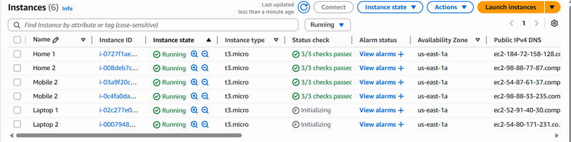

# Deploying Multiple EC2 Instances with an Application Load Balancer  
*“Hosting Apache on Multiple EC2 Instances with Path-Based Routing Using an ALB”*

---

## Overview  
This project demonstrates how to:  

- Launch multiple EC2 instances (Home, Laptop, Mobile)  
- Automatically install **Apache Web Server** using **User Data scripts**  
- Configure custom HTML files for each instance group  
- Set up an **Application Load Balancer (ALB)** with **path-based routing**  
- Create and manage **Target Groups** for Home, Laptop, and Mobile instances  

---

## Architecture Overview  

Below is the high-level architecture:  


- **6 EC2 Instances**:  
  - 2 for Home  
  - 2 for Laptop  
  - 2 for Mobile  

- **Application Load Balancer (ALB)**:  
  - Routes traffic based on path rules  
  - `/` → Home Target Group  
  - `/laptop/*` → Laptop Target Group  
  - `/mobile/*` → Mobile Target Group  


---

## Prerequisites  

- **AWS Account** with EC2 and Load Balancer permissions  
- **Key Pair** for SSH access  
- **Security Group**:  
  - Port 22 (SSH) open for connecting to instances  
  - Port 80 (HTTP) open for web traffic  

---

## Steps Followed  

### 1. Launch EC2 Instances  

Launch **six EC2 instances**:  
- 2 for **Home**  
- 2 for **Laptop**  
- 2 for **Mobile**  

Use **Amazon Linux 2023** or Amazon Linux 2 AMI.




---

### 2. Use User Data Scripts  

While launching, add the **User Data** scripts to automatically install Apache and create custom HTML pages.  

#### **Home Instances**  

```bash
#!/bin/bash
sudo yum update -y
sudo yum install httpd -y
sudo systemctl start httpd
sudo systemctl enable httpd
echo "<h1>Hello from $(hostname -f)</h1>" > /var/www/html/index.html
````

#### **Mobile Instances**

```bash
#!/bin/bash
sudo yum update -y
sudo yum install httpd -y
sudo systemctl start httpd
sudo systemctl enable httpd
sudo mkdir -p /var/www/html/mobile
echo "<h1>Mobile Page $(hostname -f)</h1>" > /var/www/html/mobile/index.html
```

#### **Laptop Instances**

```bash
#!/bin/bash
sudo yum update -y
sudo yum install httpd -y
sudo systemctl start httpd
sudo systemctl enable httpd
sudo mkdir -p /var/www/html/laptop
echo "<h1>This is laptop page from $(hostname -f)</h1>" > /var/www/html/laptop/index.html
```

---

### 3. Verify Web Pages on Each Instance

After instances are running, copy the public IP of each instance and test in a browser:

* `http://<public-ip>` for Home instances
* `http://<public-ip>/mobile` for Mobile instances
* `http://<public-ip>/laptop` for Laptop instances


---

### 4. Create Target Groups

Go to **EC2 → Target Groups → Create Target Group**.

* **Home Target Group**: Add both Home instances
* **Laptop Target Group**: Add both Laptop instances
* **Mobile Target Group**: Add both Mobile instances

    
    
    
    
    
---

### 5. Create an Application Load Balancer

Go to **EC2 → Load Balancers → Create Load Balancer**.

* Select **Application Load Balancer**

* Choose **Internet-facing**

* Configure Security Group to allow **Port 80**
* Select **Home Target Group** as the default action

---

### 6. Add Listener Rules

After creating the ALB:

* Click **View/Edit Rules** under **Listeners**

* Add rules for **Laptop** and **Mobile** target groups

#### **Laptop Rule**

* Path: `/laptop/*`

* Forward to **Laptop-TG**

* Priority: **1**


#### **Mobile Rule**

* Path: `/mobile/*`
* Forward to **Mobile Target Group**
* Priority: **2**

---

### 7. Test the ALB

Copy the **DNS Name** of the ALB from the console.

Test in your browser:

* `http://<ALB-DNS>` → Should show **Home** instance page

    1)Home 1 instance
    1)Home 2 instance

* `http://<ALB-DNS>/laptop` → Should show **Laptop** instance page
    
    1)Laptop 1 instance
    
    1)Laptop 2 instance

* `http://<ALB-DNS>/mobile` → Should show **Mobile** instance page
    
    1)Mobile 1 instance
    1)Mobile 2 instance

---

## Result

We successfully:

* Launched **6 EC2 instances** using User Data scripts
* Configured **Apache with custom paths**
* Created **Target Groups** for each instance set
* Configured an **Application Load Balancer with path-based routing**
* Verified that traffic routes correctly to the right instance group


---

## Tech Stack

* **OS**: Amazon Linux 2023
* **Web Server**: Apache (httpd)
* **Load Balancer**: AWS Application Load Balancer
* **Hosting**: AWS EC2

---

## Summary

This project shows how to deploy multiple EC2 instances with different paths and use an **Application Load Balancer** to distribute traffic based on URL paths. This approach improves scalability, makes deployments predictable, and simplifies routing across different back-end servers.

---
## Contact

If you face any issues or have questions, feel free to reach out to me:

* **Email:** [kunalshinde066@gmail.com](mailto:kunalshinde066@gmail.com)
* **LinkedIn:** [https://www.linkedin.com/in/kunal-shinde-1b17a2205/](https://www.linkedin.com/in/kunal-shinde-1b17a2205/)

---

